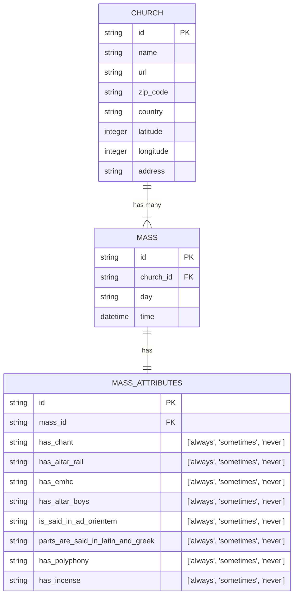

```mermaid
erDiagram
  CHURCH ||--|{ MASS : "has many"
  MASS ||--|| MASS_ATTRIBUTES : has
  CHURCH {
    string id PK
    string name
    string url
    string zip_code
    string country
    integer latitude
    integer longitude
    string address
  }
  MASS {
    string id PK
    string church_id FK
    string day
    datetime time
  }
  MASS_ATTRIBUTES {
    string id PK
    string mass_id FK
    string has_chant "['always', 'sometimes', 'never']"
    string has_altar_rail "['always', 'sometimes', 'never']"
    string has_emhc "['always', 'sometimes', 'never']"
    string has_altar_boys "['always', 'sometimes', 'never']"
    string is_said_in_ad_orientem "['always', 'sometimes', 'never']"
    string parts_are_said_in_latin_and_greek "['always', 'sometimes', 'never']"
    string has_polyphony "['always', 'sometimes', 'never']"
    string has_incense "['always', 'sometimes', 'never']"
  }
```
